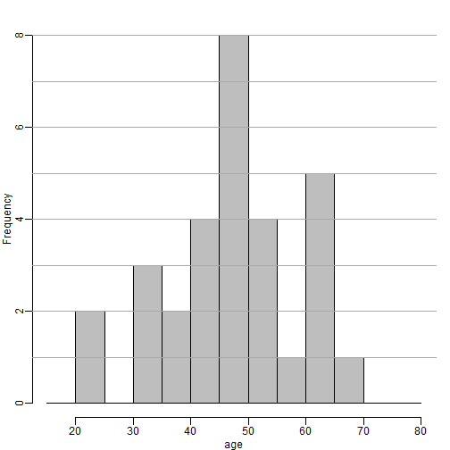

```{r setup, include=FALSE}
knitr::opts_chunk$set(echo = TRUE)
```

## Histogram Exercises

### Histogram Exercises #1

Given the above histogram, how many people are between the ages of 35 and 45?



**6**

## QQ-plot Exercises

Download this RData file to your working directory: link. Then load the data into R with the following command:

```{r}
load("skew.RData")
```

You should have a 1000 x 9 dimensional matrix 'dat':

```{r}
dim(dat)
```

Using QQ-plots, compare the distribution of each column of the matrix to a normal. That is, use qqnorm() on each column. To accomplish this quickly, you can use the following line of code to set up a grid for 3x3=9 plots. ("mfrow" means we want a multifigure grid filled in row-by-row. Another choice is mfcol.)

```{r}
par(mfrow = c(3,3))
```

Then you can use a for loop, to loop through the columns, and display one qqnorm() plot at a time. You should replace the text between ** with your own code.

```{r}
for (i in 1:9) {
  x <- dat[,i]
  qqnorm(x,  main=paste0("Q-Q plot for column V.",i,sep=""))
  qqline(x)
}
```

Identify the two columns which are skewed.

Examine each of these two columns using a histogram. Note which column has "positive skew", in other words the histogram shows a long tail to the right (toward larger values). Note which column has "negative skew", that is, a long tail to the left (toward smaller values). Note that positive skew looks like an up-shaping curve in a qqnorm() plot, while negative skew looks like a down-shaping curve.

You can use the following line to reset your graph to just show one at a time:

```{r}
par(mfrow=c(1,1))
```

### QQ-plot Exercises #1

Which column has positive skew (a long tail to the right)?

```{r}
hist(dat[,4]) 
```

### QQ-plot Exercises #2

Which column has negative skew (a long tail to the left)?

```{r}
hist(dat[,9])
```

## Boxplot Exercises

The InsectSprays data set measures the counts of insects in agricultural experimental units treated with different insecticides. This dataset is included in R, and you can examine it by typing:

```{r}
head(InsectSprays)
```
Try out two equivalent ways of drawing boxplots in R, using the InsectSprays dataset. Below is pseudocode, which you should modify to work with the InsectSprays dataset.

1) using split:

```
boxplot(split(values, factor))
```

2) using a formula:

```
boxplot(values ~ factor)
```

### Boxplot Exercises #1

Note: this question has 2 attempts, because there are only 5 options...

Which spray seems the most effective (has the lowest median)?

```{r}
boxplot(InsectSprays$count ~ InsectSprays$spray)
```

- A
- B
- **C**
- D
- E

### Boxplot Exercises #2

Let's consider a random sample of finishers from the New York City Marathon in 2002. This dataset can be found in the UsingR package. Load the library and then load the nym.2002 dataset.

```{r}
library(dplyr)
library(rafalib)

data(nym.2002, package="UsingR")
```

Use boxplots and histograms to compare the finishing times of males and females. Which of the following best describes the difference?

```{r}
mypar(1,3)
males <- filter(nym.2002, gender=="Male") %>% select(time) %>% unlist
females <- filter(nym.2002, gender=="Female") %>% select(time) %>% unlist
boxplot(females, males)
hist(females,xlim=c(range( nym.2002$time)))
hist(males,xlim=c(range( nym.2002$time)))
```

- Males and females have the same distribution.
- Most males are faster than most women.
- **Male and females have similar right skewed distributions with the former, 20 minutes shifted to the left.**
- Both distribution are normally distributed with a difference in mean of about 30 minutes.

## Scatterplot Exercises

Let's consider a random sample of finishers from the New York City Marathon in 2002. This dataset can be found in the UsingR package. Load the library and then load the nym.2002 dataset.

Here we will use the plots we've learned about to explore a dataset: some stats on a random sample of runners from the New York City Marthon in 2002. This data set can be found in the UsingR package (used in the previous assessment). Load the library and then load the nym.2002 data set with the following line:

```{r}
data(nym.2002, package="UsingR")
```

### Scatterplot Exercises #1

Use dplyr to create two new data frames: males and females, with the data for each gender. For males, what is the Pearson correlation between age and time to finish?

```{r}
males <- filter(nym.2002, gender=="Male") 
females <- filter(nym.2002, gender=="Female")
cor(males$age,males$time)
```

### Scatterplot Exercises #2

For females, what is the Pearson correlation between age and time to finish?

```{r}
cor(females$age,females$time)
```

### Scatterplot Exercises #3

If we interpret these correlations without visualizing the data, we would conclude that the older we get, the slower we run marathons, regardless of gender. Look at scatterplots and boxplots of times stratified by age groups (20-25, 25-30, etc..). After examining the data, what is a more reasonable conclusion?

```{r}
library(rafalib)
mypar(2,2)
plot(females$age, females$time)
plot(males$age, males$time)
group <- floor(females$age/5) * 5
boxplot(females$time~group)
group <- floor(males$age/5) * 5
boxplot(males$time~group)
```

- **Finish times are constant up until sometime between 50-60, then we get slower.**
- On average, finish times go up by about 7 minutes every five years.
- The optimal age to run a marathon is 20-25.
- Coding errors never happen: a five year old boy completed the 2012 NY city marathon.

## Symmetry of Log Ratios Exercises

In the previous video, we saw that multiplicative changes are symmetric around 0 when we are on the logarithmic scale. In other words, if we use the log scale, 1/2 times a number x, and 2 times a number x, are equally far away from x. We will explore this with the NYC marathon data.

Create a vector time of the sorted times:

```{r}
time = sort(nym.2002$time)
```

### Symmetry of Log Ratios Exercises #1

What is the fastest time divided the median time?

```{r}
min(time) / median(time)
```

### Symmetry of Log Ratios Exercises #2

What is the slowest time divided the median time?

```{r}
max(time) / median(time)
```

## Plots to Avoid Exercises

### Plots to Avoid Exercises #1

When is it appropriate to use pie charts or donut charts?

- When you are hungry.
- To compare percentages.
- To compare values that add up to 100%.
- **Never**

## Plots to Avoid Exercises #2

The use of pseudo-3D plots in the literature mostly adds:

- Pizzazz.
- The ability to see three dimensional data.
- Ability to discover.
- **Confusion.* correct**